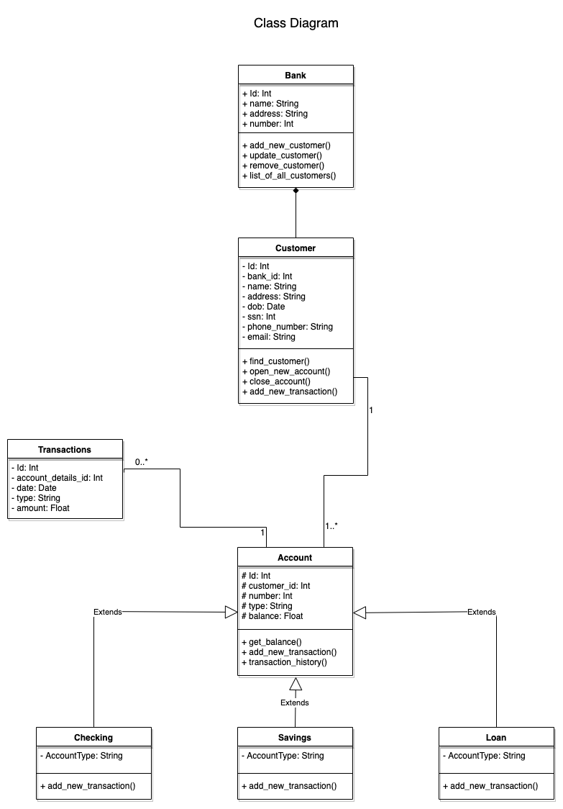
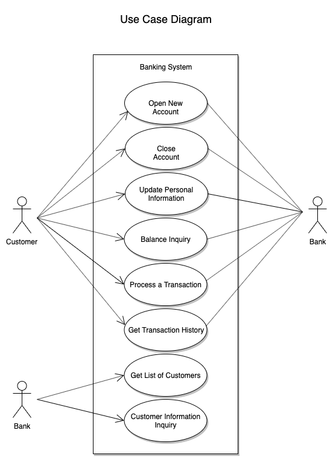
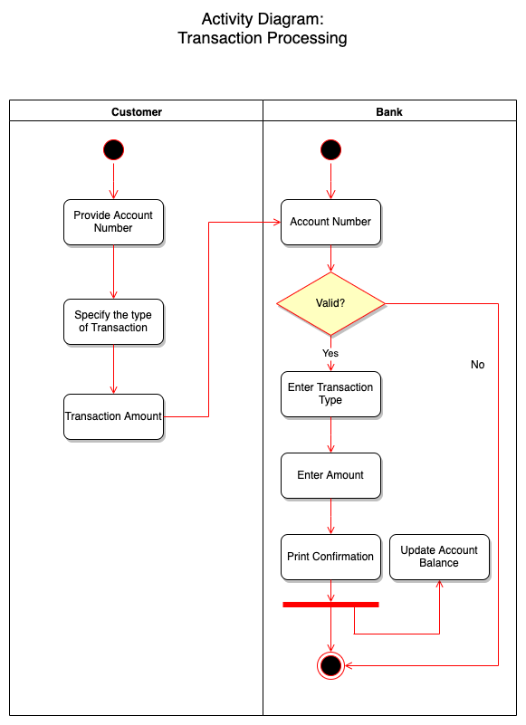

# Pet_Project-Virtual_Bank

### Travis-CI:
[](https://travis-ci.com/LenXdata/Pet_Project-Virtual_Bank)

### CircleCI
[](https://circleci.com/gh/LenXdata/Pet_Project-Virtual_Bank)

### Sonarcloud:
[](https://sonarcloud.io/dashboard?id=LenXdata_Pet_Project-Virtual_Bank)
[](https://sonarcloud.io/dashboard?id=LenXdata_Pet_Project-Virtual_Bank)
[](https://sonarcloud.io/dashboard?id=LenXdata_Pet_Project-Virtual_Bank)
[](https://sonarcloud.io/dashboard?id=LenXdata_Pet_Project-Virtual_Bank)
[](https://sonarcloud.io/dashboard?id=LenXdata_Pet_Project-Virtual_Bank)
[](https://sonarcloud.io/dashboard?id=LenXdata_Pet_Project-Virtual_Bank)
[](https://sonarcloud.io/dashboard?id=LenXdata_Pet_Project-Virtual_Bank)
[](https://sonarcloud.io/dashboard?id=LenXdata_Pet_Project-Virtual_Bank)
[](https://sonarcloud.io/dashboard?id=LenXdata_Pet_Project-Virtual_Bank)
[](https://sonarcloud.io/dashboard?id=LenXdata_Pet_Project-Virtual_Bank)

-----------------
## Part A
The project was writen with Python 3.7.3  
Database MySQL

#### To run the project you need to:

 - install necessary packages
```shell script
pip install -r requirements.txt
```
 - run MySQL Database with 'pet_project' schema
 - configure MySQL Database connection in [models](src/models.py) 
 - if you have the problem with insecure authentication, install:
 ```shell script
python3 -m pip install PyMySQL[rsa]
```

#### Run the project:
```shell script
python main.py
```
-----------------
## Part B
### Task 1 
#### UML.  
To create UML diagrams I used draw.io.

UML 1: Class Diagram

  

UML 2: Use Case diagram 

  

UML 3: Activity diagram: Transaction Processing 

  

-----------------
### Task 2  
#### Metrics.   
I used [sonarcloud.io](https://sonarcloud.io/dashboard?id=LenXdata_Pet_Project-Virtual_Bank) to run metrics.  

-----------------
### Task 3
#### Clean Code.  
I was writing my Pet Project following the Clean Code conventions for Python and [PEP8 guide](https://pep8.org/). 
Here are just a few examples of the Clean code guidelines from my code:
1. Naming conventions. I've used lowercase function names, with words separated by underscores as necessary to 
improve readability.
    ```python
   def list_of_all_customers():
        models.list_of_bank_customers()
    ```
2. Used the same vocabulary for the same type of variable.
If the entity is the same (customer), I tried to be consistent in referring to it in my functions.
    ```python
   insert_customer()
   update_customer_info()
   list_of_all_customers()
    ```
3. Used **is not** operator rather than **not ... is**. 
While both expressions are functionally identical, the former is more readable and preferred.
    ```python
   if existing_account is not None:
    ```
4. Indentation. Continuation lines should align wrapped elements either vertically using Python’s implicit line 
joining inside parentheses, brackets and braces, or using a hanging indent. I've used an alignment with opening 
delimiter.
    ```python
   models.add_new_transaction(account_no_param=account_no, transaction_type_param=transaction_type,
                               transaction_amount_param=transaction_amount)
    ```
5. Imports. I put each import on a separate line. Also, they are always put at the top of the file. 
According to convention, I grouped imports in the following order:   

   1\. standard library imports  
   2\. related third party imports  
   3\. local application/library specific imports
    ```python
    from enum import Enum
    from tabulate import tabulate
    from src import models as models
    ```
I followed many other clean code guidelines in my code. Overall, I tried to achieve consistency in my project.
Here are my favorite cheat sheets for clean code: [Cheat Sheet 1](Clean_Code_Cheat_Sheets/Clean_code_cheat_sheet.png),
[Cheat Sheet 2](Clean_Code_Cheat_Sheets/summary-of-clean-code-by-robert-c-martin.pdf).

-----------------
### Task 4
#### Build Management.  
I used Gradle and [PyGradle plugin](https://github.com/innobead/pygradle) as Build Management tools.

The plugin allows you to accomplish many tasks with one command:
 - install/build virtualenv
 - resolve dependencies
 - run tests
 - create coverages in html and xml formats
 - build python wheel 
 
To run plugin build with Gradle you need to install Java and Gradle:
```shell script
brew cask install adoptopenjdk/openjdk/adoptopenjdk12
brew install gradle
```
Run gradle build with [gradle.build](build.gradle).  
```shell script
gradle build -PpyDistType="bdist_wheel --universal"
```
Here is the build output [gradle.build.output](gradle.build.output.sh).

-----------------
### Task 5  
#### Unit Tests.  
I integrated [Unit Tests](test/test_bank.py) to test my code.

-----------------
### Task 6 
#### Continuous Delivery.    
CI (Continuous Integration) was done using **CircleCI**. Test results are downloaded and can be seen 
in the Artifacts tab for each build-job.

  *All reports are available [here](https://circleci.com/gh/LenXdata/Pet_Project-Virtual_Bank/28#artifacts/containers/0)
  *Report for all [project files]( https://28-223566043-gh.circle-artifacts.com/0/tests-result/index.html)
  *Report for the [main project file](https://28-223566043-gh.circle-artifacts.com/0/tests-result/src_bank_py.html)

For Continuous Delivery with [Travis-CI](https://travis-ci.com/LenXdata/Pet_Project-Virtual_Bank) 
you need only one file [.travis.yml](.travis.yml). 


-----------------
### Task 7 
#### IDE.    
I have used PyCharm as my IDE. Here are my most favorite shortcuts using Mac QWERTY keyboard:
 - ⌘E - Recent Files popup window
 - ⇧F6 - Refactoring/Rename
 - ⌥⌘L - Reformat Code
 - ⌃Space - Auto completion
 - ⌘D - Duplicate Line or Selection
 
 And many others.

-----------------
### Task 8 
#### DSL. 
I’ve created a DSL that lets users easily work with my bank project by calling into the functions that I have built. 
The program has a simple but nice console interface and users can work with it by entering commands, without any 
programming experience.


I created a domain-specific language that resembles my UML class diagram. My DSL includes entities together with 
associations and implementation relationships. 
With my DSL I tried to capture different parts of banking experience. 
For example, banking is about financial transactions and customer relations. I have combined both parts in my program.


So by entering simple commands a user can work with the main menu and move from one part to another. 
Also, a user has an ability for more complex entries, for example when adding a new bank customer. 
It is as simple as typing in customers information and confirming it by hitting an “enter”. 
The program will then display entered records for review.
